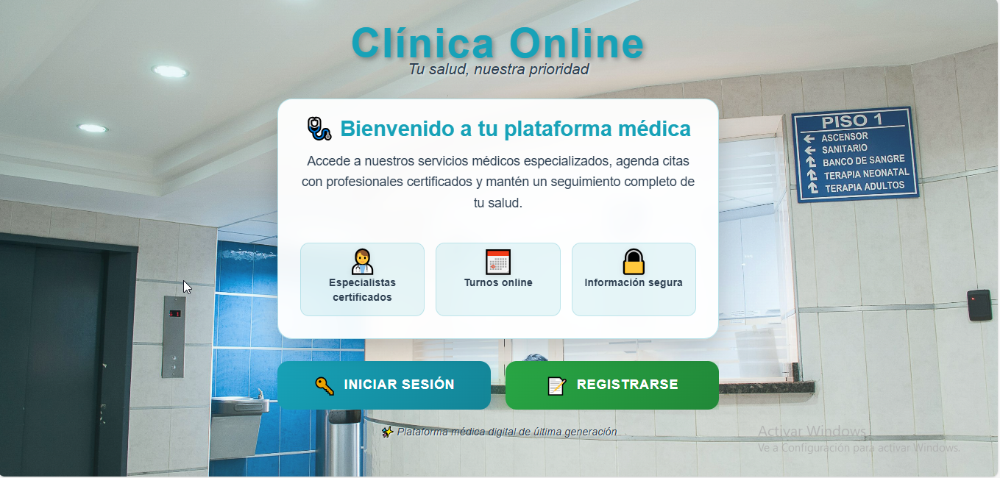
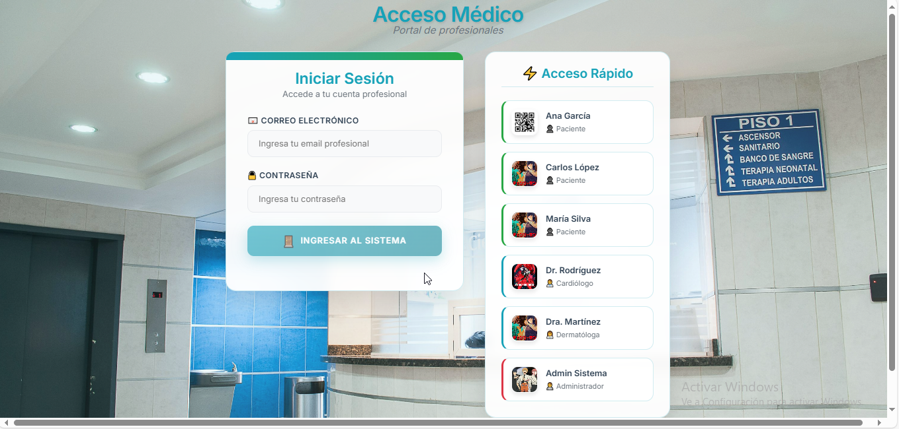

# 🏥 Clínica Online - Sistema de Gestión de Turnos Médicos

[](https://angular.io/)
[](https://firebase.google.com/)
[](https://www.typescriptlang.org/)
[](https://supabase.com/)

## 📋 Descripción

**Clínica Online** es una plataforma web moderna y completa para la gestión de turnos médicos. Permite a pacientes, especialistas y administradores interactuar de manera eficiente en un entorno digital seguro y fácil de usar.

### 🚀 [Ver Demo en Vivo](https://clinica-online-6537c.web.app)

---

## ✨ Características Principales

### 👥 **Gestión de Usuarios Multi-Rol**
- **Pacientes**: Solicitud y gestión de turnos
- **Especialistas**: Administración de horarios y consultas
- **Administradores**: Control total del sistema

### 📅 **Sistema de Turnos Inteligente**
- Reserva de turnos en 3 pasos intuitivos
- Validación en tiempo real de disponibilidad
- Integración con horarios de especialistas
- Prevención de dobles reservas

### 🔐 **Seguridad y Autenticación**
- Sistema de login seguro
- Validación de roles y permisos
- Protección de rutas sensibles

---

## 🖼️ Capturas de Pantalla

### 🏠 Pantalla de Bienvenida
*Interfaz principal que da la bienvenida a los usuarios*

<!-- Para agregar esta imagen:
1. Toma una captura de pantalla de tu página de bienvenida
2. Guárdala como 'welcome.png' en la carpeta screenshots/
3. Súbela a tu repositorio de GitHub
-->


### 🔑 Sistema de Autenticación
*Login y registro de usuarios con validación*




### 📋 Solicitar Turno - Flujo de 3 Pasos
*Proceso intuitivo para reservar citas médicas*

**Paso 1: Selección de Profesional**


**Paso 2: Selección de Especialidad**


**Paso 3: Selección de Fecha y Hora**


### 👨‍⚕️ Panel de Especialista
*Gestión de turnos y horarios para médicos*


### 🏥 Panel de Administración
*Control administrativo del sistema*


### 📱 Mis Turnos (Pacientes)
*Vista de turnos para pacientes*


---

## 🛠️ Tecnologías Utilizadas

### **Frontend**
-  **Angular 17+** - Framework principal
-  **TypeScript** - Lenguaje de programación
-  **SCSS** - Estilos avanzados
-  **Bootstrap** - Framework CSS

### **Backend & Base de Datos**
-  **Supabase** - Base de datos PostgreSQL
-  **Firebase Hosting** - Alojamiento web

### **Herramientas de Desarrollo**
-  **Git** - Control de versiones
-  **VS Code** - Editor de código
-  **npm** - Gestor de paquetes

---

## 🚀 Instalación y Configuración

### **Prerrequisitos**
- Node.js (v18 o superior)
- npm o yarn
- Angular CLI
- Firebase CLI
- Cuenta de Supabase

### **Pasos de Instalación**

1. **Clonar el repositorio**
   ```bash
   git clone https://github.com/joaquinyjoa/Clinica_Online.git
   cd Clinica_Online/clinica
   ```

2. **Instalar dependencias**
   ```bash
   npm install
   ```

3. **Configurar variables de entorno**
   ```bash
   # Crear archivo de configuración de Firebase
   # Configurar credenciales de Supabase en services/supabase.service.ts
   ```

4. **Ejecutar en modo desarrollo**
   ```bash
   ng serve
   ```
   La aplicación estará disponible en `http://localhost:4200`

5. **Compilar para producción**
   ```bash
   ng build
   ```

6. **Desplegar en Firebase**
   ```bash
   firebase login
   firebase deploy
   ```

---

## 📱 Funcionalidades por Rol

### 👤 **Pacientes**
- ✅ Registro y login seguro
- ✅ Solicitar turnos en 3 pasos
- ✅ Ver historial de turnos
- ✅ Cancelar turnos
- ✅ Actualizar perfil personal

### 👨‍⚕️ **Especialistas**
- ✅ Gestión de horarios disponibles
- ✅ Ver turnos asignados
- ✅ Aceptar/rechazar solicitudes
- ✅ Agregar comentarios a consultas
- ✅ Configurar especialidades

### 👨‍💼 **Administradores**
- ✅ Gestión completa de usuarios
- ✅ Aprobación de especialistas
- ✅ Visualización de estadísticas
- ✅ Control de accesos
- ✅ Configuración del sistema

---

## 🔧 Arquitectura del Proyecto

```
clinica/
├── src/
│   ├── app/
│   │   ├── components/          # Componentes de la aplicación
│   │   │   ├── login/           # Sistema de autenticación
│   │   │   ├── register/        # Registro de usuarios
│   │   │   ├── solicitar-turno/ # Flujo de reserva de turnos
│   │   │   ├── mis-turnos/      # Gestión de turnos pacientes
│   │   │   ├── panel-admin/     # Panel administrativo
│   │   │   └── welcome/         # Página de bienvenida
│   │   ├── services/            # Servicios de datos
│   │   │   ├── firebase.ts      # Configuración Firebase
│   │   │   ├── supabase.service.ts # Servicio de base de datos
│   │   │   └── turnos.service.ts   # Lógica de turnos
│   │   └── guards/              # Protección de rutas
│   └── assets/                  # Recursos estáticos
├── firebase.json               # Configuración de despliegue
└── angular.json               # Configuración de Angular
```

---

## 📊 Base de Datos

### **Tablas Principales**
- `usuarios` - Información de todos los usuarios
- `pacientes` - Datos específicos de pacientes
- `especialistas` - Información de médicos
- `turnos` - Registro de citas médicas
- `horarios_especialistas` - Disponibilidad de médicos
- `especialidades` - Catálogo de especialidades médicas

---

## 🤝 Contribución

1. Fork el proyecto
2. Crea una rama para tu feature (`git checkout -b feature/AmazingFeature`)
3. Commit tus cambios (`git commit -m 'Add some AmazingFeature'`)
4. Push a la rama (`git push origin feature/AmazingFeature`)
5. Abre un Pull Request

---

## 📄 Licencia

Este proyecto está bajo la Licencia MIT. Ver el archivo `LICENSE` para más detalles.

---

## 👨‍💻 Desarrollador

**Joaquín**
- GitHub: [@joaquinyjoa](https://github.com/joaquinyjoa)
- Email: joaquin@email.com

---

## 📞 Soporte

Si tienes preguntas o necesitas ayuda:
- 🐛 Reporta bugs en [Issues](https://github.com/joaquinyjoa/Clinica_Online/issues)
- 💬 Discusiones en [Discussions](https://github.com/joaquinyjoa/Clinica_Online/discussions)

---

*⭐ Si este proyecto te fue útil, no olvides darle una estrella en GitHub*
